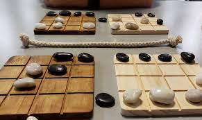

## How to Play
* Line up the pink and red pieces on the top rows of each board, and the green and teal pieces on the bottom rows, so that red faces green and pink faces teal.
* Choose which player will be **first** and control green and red pieces, and which will be **second** and control green and teal pieces.  The top two boards are considered the **first player homeboards** and the bottom two are the **second player homeboards**.
* Starting with the first player, the two players take turns playing.  Each turn consists of two moves: first a **passive move** and then an **aggressive move** and both moves must be made each turn.
1. The passive move: a player moves a piece on one of their homeboards one or two spaces horizontally, vertically, or diagonally.  It may not collide with, push, jump over, or land on any other pieces.  You also may not move your own piece off of the board.
2. The aggressive move: a player moves a piece of their second color in exactly the same direction as they moved their third piece.  In the aggressive move, your piece will push any opponents pieces it collides with.  However, you cannot push more than one piece at a time and you may not move your own piece off of the board.  Note that this limits the available passive moves.
* If a piece is pushed off of the gameboard, it is removed from the game.  The first player to push all of their opponents pieces off of *one* of the gameboards wins.

## How to Play Online
* [Video tutorial for playing online](https://www.youtube.com/watch?v=g9jXe6CSEkU)

