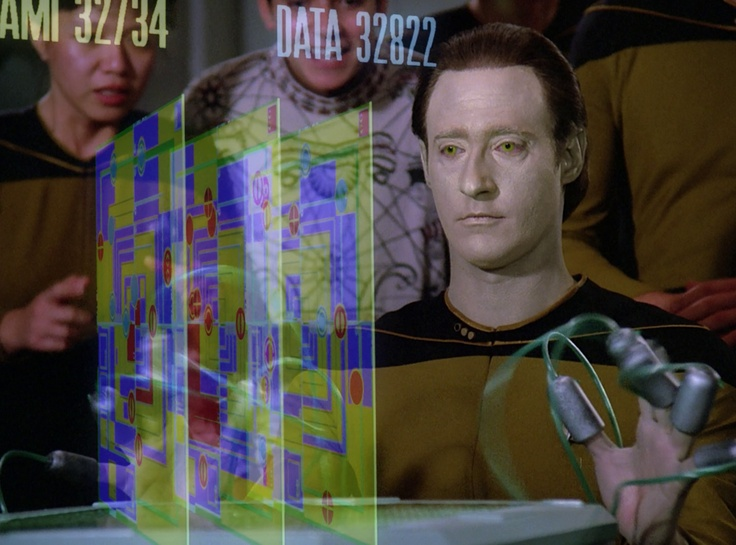

### Perfect play

The term **perfect play** refers to when a player plays a strategy that leads to the best possible outcome for that player, or the most likely best outcome in a probablistic scenario, regardless of the choices of their opponent.

Think, for example, about *tic-tac-toe*.  Can we identify what would be **perfect play** for the player who goes first?
What about the second player?

A game where there is a known definitive strategy for a player to force a win or a draw by playing perfectly in the staring game is called a **solved game**.  As you probably have noted, *tic-tac-toe* is an example of a solved game!  In particular, the first player can always force a draw (or a win if the second player messes up).

However, it turns out there are surprising number of other games out there which are solved, some of which you've probably heard of before!
For example
* *Connect Four* [(strategy-based proof (link))](http://www.informatik.uni-trier.de/~fernau/DSL0607/Masterthesis-Viergewinnt.pdf)
* *Guess Who?* [(probabilistic proof (link))](https://arxiv.org/pdf/1509.03327.pdf)
* *mancala* [($$106$$-day calculation on supercomputer)](https://jabaier.sitios.ing.uc.cl/iic2622/kalah.pdf)
* *checkers* [($$18$$-year long computer calculation)](https://www.theatlantic.com/technology/archive/2017/07/marion-tinsley-checkers/534111/)

What about if you take over a game for a friend in the middle?  Games where a strategy for perfect play is known for *any* given board state are called **strongly solved**.
*Tic-tac-toe* is strongly solved, for example.  So are *Guess Who?* and *Connect Four*.

### Ultra weakly solved games

Intriguingly, sometimes we can prove that a game *has* a strategy that will allow a specific player to win or draw (ie. the game has a solution), even if we don't know what it is.
In a way, these are the most intriguing examples, since it involves a non-constructive existence argument and must leverage something fundamental about the nature of the game.

Consider, for example, the **Divisor Game** is a two-player game which has the following rules
* Fix a starting integer $$N$$.
* Each player takes turns choosing positive integer divisors of $$N$$.
* You cannot choose a positive integer divisor of $$N$$ which divides any previously chosen divisors.
* The player that is forced to choose $$N$$ loses.

We can prove that the first player (*P1*) to move can force a win or a draw, even though *how* is still an open problem.
Here's the argument:
1. Suppose that the second player (*P2*) has a winning strategy, no matter what number *P1* starts out with.
2. Then *P2* should have a winning strategy in particular when *P1* chooses $$1$$, in particular they would have a particular number $$k$$ to follow.
3. However, instead of choosing $$1$$ as their first move, *P1* chooses $$k$$
4. Now the board state is the same as it would have been if *P2* had gone first (choosing $$1$$) and *P1* is following the perfect second-player strategy.

Thus it's not possible for *P2* to have a winning strategy, so *P1* must be able to force a win or a draw.
Draws aren't possible, so *P1* can force a win!

