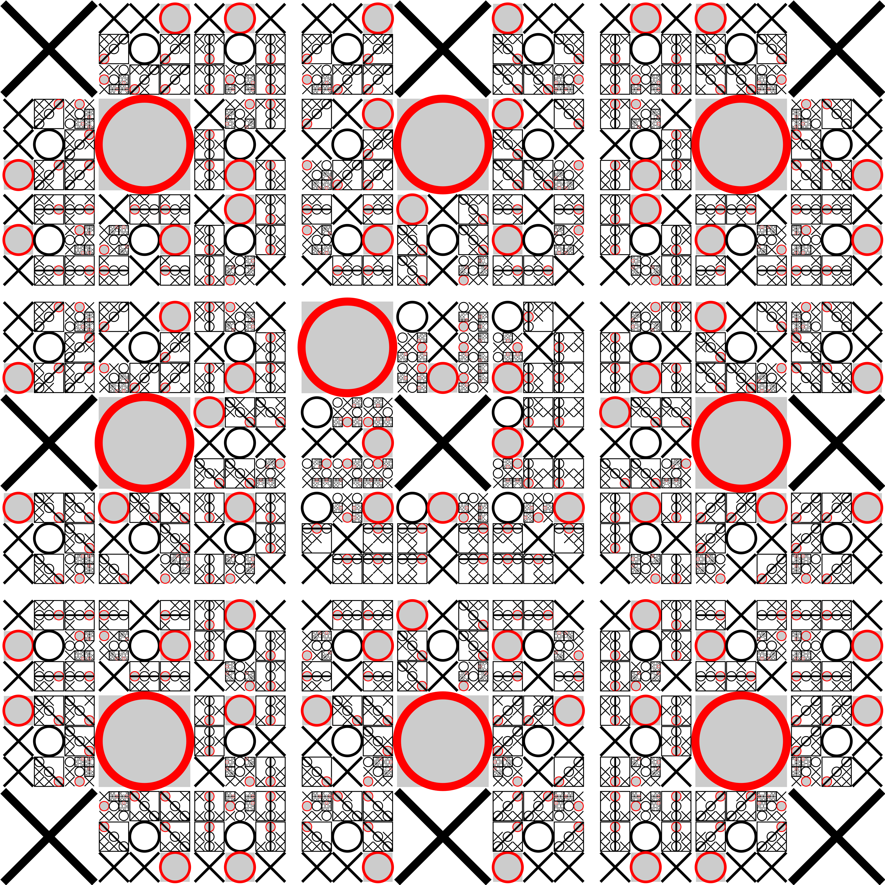

## Introduction

The game **Tic-tac-toe** is familiar to everyone and has its origins in ancient antiquity.
In fact, early variations of the game can be found on Egyptian roofing tiles dated back to $$1300$$ BC!

## Playing tic-tac-toe online

To play tic-tac-toe online, we will use the website [https://papergames.io/en/tic-tac-toe](https://papergames.io/en/tic-tac-toe).
To start, follow these instructions:
1. Go to [https://papergames.io/en/tic-tac-toe](https://papergames.io/en/tic-tac-toe)  You may be prompted to enter in a nickname, but you shouldn't be required to sign up or sign in.
2. Click the button *Play with a friend*.  This should generate a unique website link which you can share with your opponent.  Once they follow the link, you both should be able to play.

