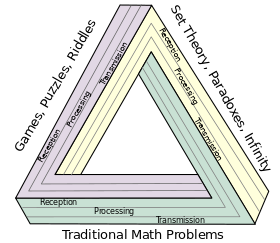

---
#
# By default, content added below the "---" mark will appear in the home page
# between the top bar and the list of recent posts.
# To change the home page layout, edit the _layouts/home.html file.
# See: https://jekyllrb.com/docs/themes/#overriding-theme-defaults
#
layout: home
title: Math 180 Strategies of Problem Solving
---

**Instructor:** Dr. W. Riley Casper

**Email:** wcasper@fullerton.edu

**Course meetings:** Monday and Wednesday  10:00AM-11:50AM

**Office hours:** to be determined and by appointment

**Zoom number for lectures/office hours:** <a target="_parent" href="https://fullerton.zoom.us/j/86718734195?pwd=K3BZVDRYSTFtUkZhdVR5UWtYcUY4dz09">86718734195</a>

**Passcode:** 112358

**Syllabus:** <a target="_parent" href="syllabus.html">Course syllabus (link)</a>

**First steps**

Please familiarize yourself with the syllabus and the Canvas site for this course, starting with the <a target="_parent" href="">Orientation Module (link)</a>.  Also, be sure that you have the necessary technological requisites for remote office hours:
* A reliable internet connection
* Zoom
* A webcam
* A microphone

Please reach out as soon as possible if you have any questions or concerns.

***

## New posts!

